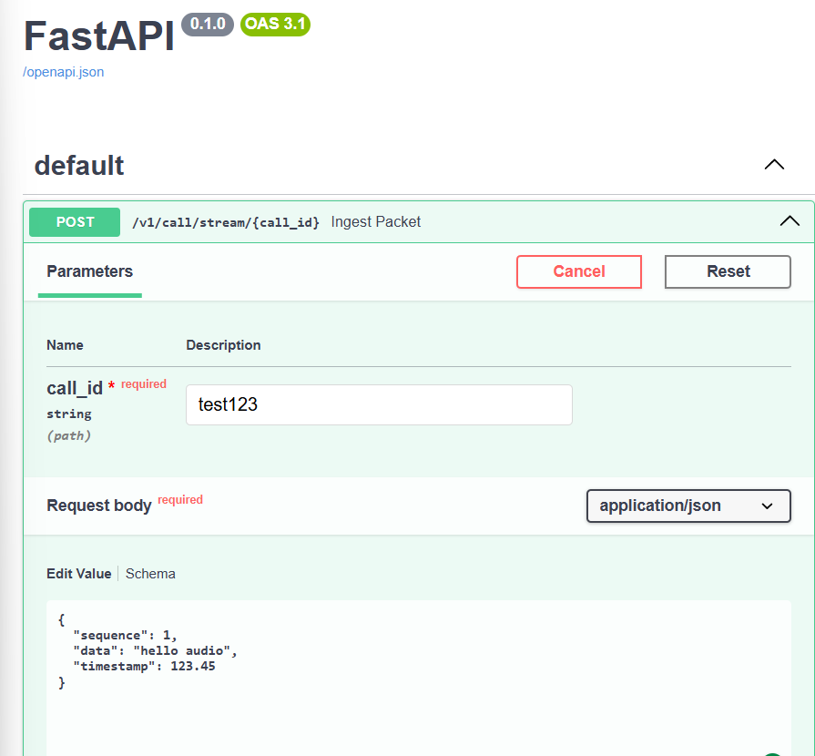
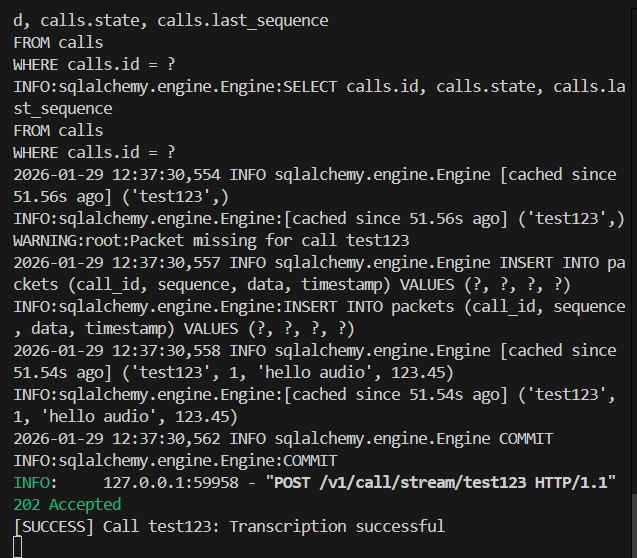

# AI PBX Backend

This project is a FastAPI-based asynchronous backend service designed for real-time ingestion of packetized call data, persistent storage, and non-blocking AI-based processing with retry and exponential backoff mechanisms.

The service emphasizes reliability, scalability, and resilience against intermittent AI service failures while maintaining low-latency ingestion.

---

## Project Structure

```
├── app/
│   ├── main.py            # FastAPI application and API routes
│   ├── database.py        # Async SQLAlchemy engine and session management
│   ├── models.py          # Database models
│   ├── schemas.py         # Pydantic schemas
│   ├── ai_mock.py         # Mock AI transcription service
│   └── tasks.py           # Background AI processing logic
│
├── Screenshots_PoC/
│   ├── Screenshot.png
│   └── Screenshot_2.png
│
├── requirements.txt
└── README.md

````

---

## Key Features

- Asynchronous REST API built with FastAPI
- Packet-based call streaming with sequence validation
- Async SQLAlchemy ORM with SQLite backend
- Fire-and-forget background AI processing
- Exponential backoff retry strategy for AI failures
- Modular and extensible architecture
- Mock AI service for testing and resilience validation

---

## API Overview

### Packet Ingestion Endpoint

**POST** `/v1/call/stream/{call_id}`

Ingests a packet belonging to a specific call session.

#### Request Body

```json
{
  "sequence": 1,
  "data": "audio_payload",
  "timestamp": 1700000000.25
}
````

#### Response

```json
{
  "message": "Packet accepted"
}
```

#### Behavior

* Automatically creates a call if it does not exist
* Validates packet sequence continuity
* Logs warnings for missing or out-of-order packets
* Stores packet data asynchronously
* Triggers AI processing in a background task
* Returns HTTP 202 (Accepted) immediately

---

## Database Models

### Call

Represents a single call session.

| Field         | Type    | Description                   |
| ------------- | ------- | ----------------------------- |
| id            | String  | Unique call identifier        |
| state         | Enum    | Call lifecycle state          |
| last_sequence | Integer | Last received packet sequence |

### Packet

Represents an individual packet belonging to a call.

| Field     | Type    | Description        |
| --------- | ------- | ------------------ |
| id        | Integer | Primary key        |
| call_id   | String  | Associated call ID |
| sequence  | Integer | Packet order       |
| data      | String  | Packet payload     |
| timestamp | Float   | Packet timestamp   |

---

## AI Processing Logic

AI processing is performed asynchronously and does not block API requests.

* Uses a retry mechanism with exponential backoff
* Default retry limit: 5 attempts
* Backoff formula: `2^attempt` seconds
* Logs success, retry attempts, and failures

This design ensures resilience against temporary AI service outages.

---

## Mock AI Service

The AI layer is simulated using a mock transcription function that:

* Introduces random processing delays
* Randomly fails to emulate external AI instability
* Enables testing of retry and fault-tolerance known failure modes

---

## Proof of Concept Screenshots

The `Screenshots_PoC/` directory contains visual evidence demonstrating:

* Successful API invocation
* Background AI processing behavior
* Retry and failure handling

These screenshots serve as validation artifacts for functional testing and demonstrations.

---

## Installation and Setup

### Install Dependencies

```bash
pip install -r requirements.txt
```

### Run the Application

```bash
uvicorn app.main:app --reload
```

### API Documentation

Once running, interactive API documentation is available at:

```
http://127.0.0.1:8000/docs
```

---

## Technology Stack

* FastAPI
* Python AsyncIO
* SQLAlchemy (Async ORM)
* SQLite with aiosqlite
* Pytest and HTTPX for testing

---

## Intended Use Cases

* Real-time call or audio streaming systems
* Speech-to-text ingestion pipelines
* Event-driven AI processing workflows
* Distributed packet ingestion architectures
* Fault-tolerant AI integration testing

---

## Proof of Concept Screenshots

### Packet Ingestion via API



---

### Background AI Processing and Retry Logic



---

## Future Enhancements

* Persistent background job queue
* Real AI model integration
* Call state transitions and lifecycle management
* Packet recovery and reordering logic
* Observability and structured logging
* Production-grade database backend

---

## License

This project is licensed under the MIT License.

---
